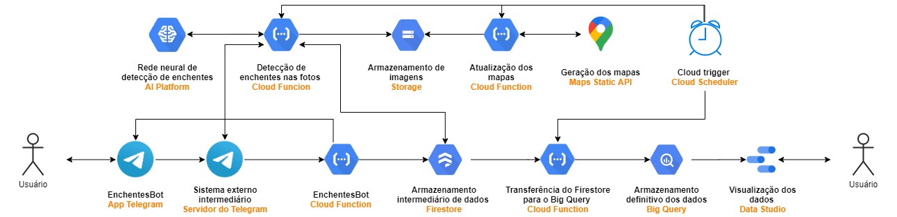

# Sistema de detecção e monitoramento de enchentes em cidades

## Resumo do sistema

Na cidade de São Paulo, quando há chuvas fortes, normalmente ocorrem enchentes. Elas acarretam em elevados danos materiais, proliferação de doenças, atrasos e estresse. Muitas dessas consequências poderiam ser evitadas se as pessoas soubessem previamente onde as enchentes estão ocorrendo ou quando e onde vão ocorrer. Porém, não há um local centralizado com essas informações, fazendo com que a população saiba apenas através de portais de notícia e compartilhamentos.

Com isso em mente, os alunos de engenharia de computação da Escola Politécnica da USP Erick Ribeiro Otsuka e Lucas Magalhães Cordeiro desenvolveram um trabalho de conclusão de curso para facilitar o acesso a essa informação para a população e autoridades. Com isso, busca-se tornar as enchentes mais fáceis de serem contornadas, diminuindo os danos causados por elas.

O sistema funciona com a colaboração da população com informações. O usuário começa a interagir com a plataforma através de um bot no Telegram chamado EnchentesBot. Utilizando o bot, é possível reportar um novo foco de enchente ao realizar três etapas: compartilhar a localização, enviar uma foto da enchente e indicar qual o nível de gravidade da mesma, segundo uma imagem de referência. Nele também é possível consultar onde estão ocorrendo enchentes no momento. Outra forma de utilização do sistema pelo usuário é a visualização de dados históricos de enchentes em um dashboard que contém gráficos, tabelas e um mapa que apresenta a localização e gravidade de enchentes. 

A arquitetura foi projetada para funcionar de forma escalonável na nuvem, conseguindo aumentar suas capacidades conforme o número de usuários aumenta, e de maneira que seja fácil adicionar novas funcionalidades, como a predição de enchentes e o envio de alertas para os usuários.



# Setup do projeto na Google Cloud Platform (GCP)

É necessário criar um novo projeto na Google Cloud Platform. Para o bot do Telegram funcionar serveless, foi escolhido fazer o deploy do mesmo por meio de uma Cloud Funcion. No geral, para ativar Cloud Functions, o seguinte tutorial pode ser seguido: 
[Cloud functions Quickstart](https://cloud.google.com/functions/docs/quickstart)

## Criação do bot do Telegram

Para criar um bot no Telegram basta iniciar uma conversa com o BotFather e registrar um novo bot pelo comando \newbot.

## Setup do Webhook

Existem duas formas de obter novas mensagens que foram feitas para o bot: por meio do pooling de mensagens (perguntar para o Telegram se chegaram novas mensagens) ou recebendo a mensagem automaticamente quando ela for feita. Para essa segunda opção, é necessário informar uma URL aos servidores do Telegram para que ele poste mensagens novas sempre que estas chegarem. Esse método é chamado de Webhook e para configurá-lo, de forma simples, basta acessar a url abaixo por qualquer navegador:

```
https://api.telegram.org/bot<TOKEN>/setWebhook?url=<CLOUD_FUNCTION_URL>

Em que:
1. <TOKEN> é o token bot do Telegram.
2. <CLOUD_FUNCTION_URL> é a URL da Cloud Function que contém o bot
```

A única Cloud Function que o Webhook irá acessar é a possui o bot do Telegram, com toda a lógica de como a interação com o mesmo será feita. A seguir serão apresentados os caminhos para as explicações de todos os módulos que foram desenvolvidos.

# O sistema

O sistema é composto pelo bot no telegram, por quatro Cloud Functions, três HTTP triggers que devem ser criados no Cloud Scheduler ou ferramenta semelhante e um conector entre a tabela em que os dados são salvos no Google Big Query e o Data Studio (ferramenta de visualização de dados).

As Cloud Functions são:
* A que contém a lógica do [bot no telegram](https://github.com/lucas-magalhaes-c/TCC_FloodFeel/tree/main/src/telegram_bot_cf) e que escalona de acordo com a quantidade de usuários acessando o bot
* A que [solicita a detecção de enchente nas fotos e que salva tais fotos no Cloud Storage](https://github.com/lucas-magalhaes-c/TCC_FloodFeel/tree/main/src/flood_detection_and_photo_storage_cf), ativada por cloud trigger.
* A que [atualiza os mapas gerados pela Maps Static API e que salva eles no Cloud Storage](https://github.com/lucas-magalhaes-c/TCC_FloodFeel/tree/main/src/current_flood_locations), também ativada por cloud trigger.
* A que [transfere os dados armazenados temporariamente no Firestore para o Big Query](https://github.com/lucas-magalhaes-c/TCC_FloodFeel/tree/main/src/fs_to_bq_cf), também ativada por cloud trigger.

Caso os triggers sejam criados no Cloud Scheduler, a seguinte ordem de criação é sugerida:
* Criação de uma *service account* com os roles *Cloud Functions Invoker* e *Cloud Scheduler Admin*

## 
